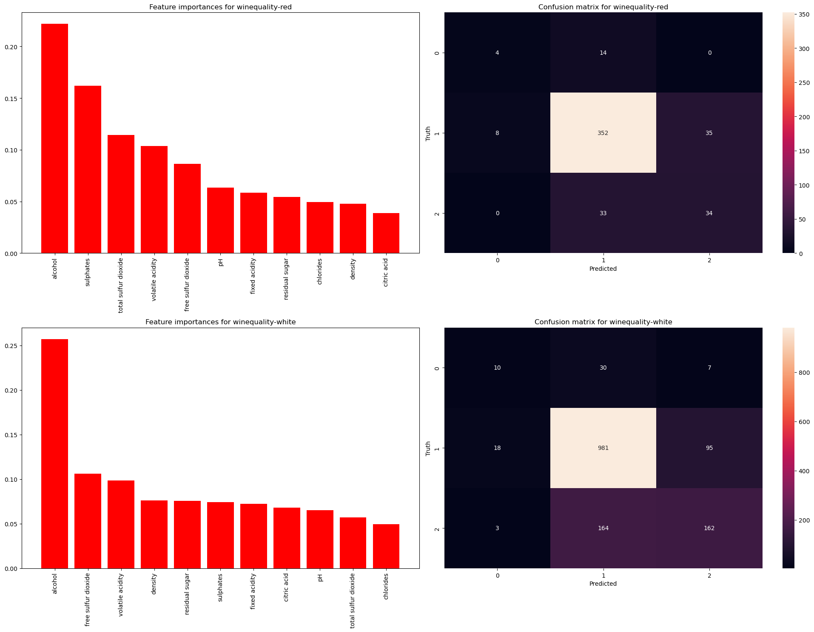
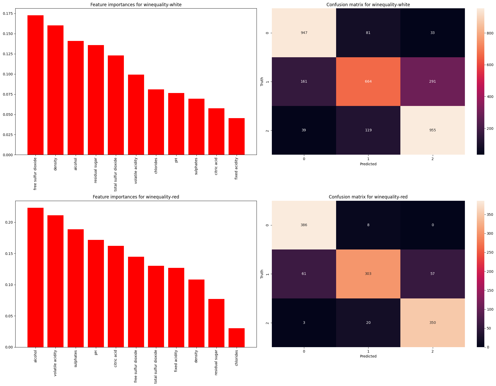
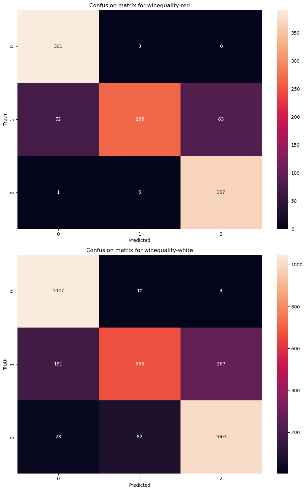

# Wine-Classifier
Using two datasets consisting of physicochemical data from red and white Vinho Verde wine samples, from the north of Portugal, and a quality classification, we concluded tests to try to classify wines based on their features. 

# Evaluation

## Decision Trees
The model demonstrated high accuracy, particularly with the white wine dataset. Its optimal performance was achieved using SMOTE oversampling. Feature selection had minimal impact, and due to the algorithm's nature, normalization didn't affect the results. The model's performance declined when data was missing but improved upon restoration, but still not to the level of the original dataset.

Red: - Accuracy of Decision Tree on winequality-red: 0.7895833333333333

White: - Accuracy of Decision Tree on winequality-white: 0.780952380952381

### The overview of experiments and conclusions is presented in the `DecistionTrees.ipynb` notebook.

## Multilayer Perceptron
The model performs quite well, particularly following data normalization and balancing through SMOTE data augmentation, achieving noteworthy accuracy rates of 87% on the red wine dataset and 78% on the white wine dataset. In general normalization improves model's accuracy. The model exhibits reduced performance when faced with instances where data has been removed and subsequently restored. Selecting the most crucial features did not yield a significant improvement. 

Accuracy of MLP on winequality-white: 0.7799392097264438

Accuracy of MLP on winequality-red: 0.8745791245791246

### A comprehensive overview of all experiments and conclusions can be found in the `MLP.ipynb` notebook.

## K-Nearest Neighbors

The model performs very good. The accuracy reaches 86% for red wine and 82% for white wine. The best results are achieved after SMOTE oversampling and data normalization. Diffferent values of k were tested. The best results were achieved for k=5. K=3 showed similar results. K=7 showed slightly worse results. Any work with dealing with missing values did not improve the results, however restoring missing values with mean values showed promising results in case of missing values in the dataset.

Red:  - Accuracy of KNN on winequality-red: 0.8619528619528619

White: - Accuracy of KNN on winequality-white: 0.8261398176291793

### More details can be found in `KNN.ipynb` notebook.

